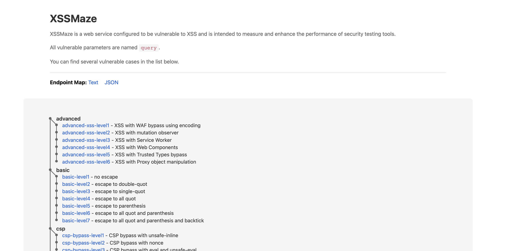

[](https://github.com/hahwul/xssmaze/actions/workflows/crystal_build.yml)
[](https://github.com/hahwul/xssmaze/actions/workflows/crystal_lint.yml)
[](https://github.com/hahwul/xssmaze/actions/workflows/ghcr.yml)

XSSMaze is a web service configured to be vulnerable to XSS and is intended to measure and enhance the performance of security testing tools. You can find several vulnerable cases in the list below, including DOM, decode, SVG, JSON, polyglot-style contexts, browser-state flows such as `window.name`, storage, `postMessage`, and `document.referrer`, dedicated `opener/*` cases that recover attacker-controlled data from `window.opener`, dedicated `referrer/*` cases that reparse `document.referrer` into sinks like `createContextualFragment` and `<template>.innerHTML`, storage-event flows that sink `StorageEvent.newValue` and `StorageEvent.oldValue`, stream-style message flows that attach real `EventSource` and `WebSocket` instances before dispatching attacker-controlled `MessageEvent` payloads, channel-based cases using `BroadcastChannel`, `MessageChannel`, and `Worker` messaging, service-worker message flows that self-dispatch attacker-controlled `MessageEvent` payloads or JSON relays from a `seed` bootstrap, navigation-state flows built on `history.replaceState`, and reparse flows built around `URLSearchParams`, nested querystrings, and template wrappers.

## Focus Areas

- `browser-state/*`: cases that need state bootstrap such as `window.name`, storage, and referrer propagation.
- `opener/*`: cases that depend on a same-origin popup relationship so the sink reads attacker-controlled data back through `window.opener`.
- `storage-event/*`: cases that need a second same-origin browsing context so `localStorage` writes surface as `StorageEvent` fields like `newValue` and `oldValue`.
- `stream/*`: cases that construct real `EventSource` and `WebSocket` objects, then drive their `message` handlers with attacker-controlled `MessageEvent` data without depending on a live upstream server.
- `channel/*`: cases that need an active sender or secondary execution context before the vulnerable sink receives data.
- `service-worker/*`: cases that attach `navigator.serviceWorker` message listeners and then self-dispatch attacker-controlled `MessageEvent` payloads or JSON relays from a `seed` bootstrap.
- `history-state/*`: cases that bootstrap `history.state` before sending HTML into sinks like `innerHTML` and `srcdoc`.
- `referrer/*`: cases that require a controlled referrer and then reparse `document.referrer` into modern sinks such as `createContextualFragment` and cloned `<template>` content.
- `reparse/*`: cases that serialize `URLSearchParams`, rebuild nested and double-nested querystrings, or wrap payloads in `<template>` and `srcdoc` shells before execution.

### Expected Dalfox Gaps

- `channel/*` cases are designed to pressure scanners that only model direct URL sources or simple `postMessage` flows.
- `opener/*` cases are designed to pressure scanners that know `window.opener` as a source in isolation but still lack reproducible PoC generation or source-preserving reporting once the payload is bootstrapped through a same-origin popup.
- `storage-event/*` cases are designed to pressure scanners that understand direct storage reads like `localStorage.getItem` but do not yet model `StorageEvent.newValue` and `StorageEvent.oldValue` as browser event sources that require a secondary context to trigger.
- `stream/*` cases are designed to pressure scanners that know generic `event.data` but fail to preserve more specific source labels such as `EventSource.message` or `WebSocket.message` once the sink is reached through `onmessage` and `addEventListener('message', ...)`.
- `service-worker/*` cases are designed to pressure scanners that can statically label `ServiceWorker.message` but still fail to upgrade deterministic self-bootstrap flows where the page itself dispatches the attacker-controlled `MessageEvent` from a URL-carried `seed`.
- Dalfox is likely to detect some of these as generic `event.data`-style DOM-XSS, but executable PoC generation and verification may still lag because the source is primed by `BroadcastChannel`, `MessagePort`, or `Worker` message delivery rather than a first-class URL mutation.
- `history-state/*` cases pressure scanners that know the `history.state` source in static analysis but do not build usable seed/bootstrap PoCs for navigation-state driven execution.
- `referrer/*` cases are designed to pressure scanners that already recognize `document.referrer` but still flatten everything into a simple `document.write`-style finding instead of preserving the later reparsing into fragment/template sinks.
- `reparse/*` cases are intended to expose places where Dalfox may still collapse the finding into a generic URL-driven DOM-XSS report even though the exploitable value is only recovered after one or more `URLSearchParams` reparses, nested bootstrap parameters such as `blob=outer=query=...`, or HTML wrapper steps such as `<template>` cloning and `srcdoc` construction.



## Installation
### From Source 
```bash
# Install dependencies
shards install

# Build
shards build # Dev build
shards build --release --no-debug --production

# Run XSSMaze
# Defatul: http://0.0.0.0:3000
./bin/xssmaze
```

### From Docker
```bash
docker pull ghcr.io/hahwul/xssmaze:main
```

## Usage
```bash
./xssmaze

# -b HOST, --bind HOST             Host to bind (defaults to 0.0.0.0)
# -p PORT, --port PORT             Port to listen for connections (defaults to 3000)
# -s, --ssl                        Enables SSL
# --ssl-key-file FILE              SSL key file
# --ssl-cert-file FILE             SSL certificate file
# -h, --help                       Shows this help
```

## Map API
```
curl http://localhost:3000/map/text
curl http://localhost:3000/map/json
```

```http
HTTP/1.1 200 OK
Connection: keep-alive
Content-Length: 611
Content-Type: application/json
X-Powered-By: Kemal

{
    "endpoints": [
        "/basic/level1/?query=a",
        "/basic/level2/?query=a",
        "/basic/level3/?query=a",
        "/basic/level4/?query=a",
        "/basic/level5/?query=a",
        "/basic/level6/?query=a",
        "/basic/level7/?query=a",
        "/dom/level1/",
        "/dom/level2/",
        "/dom/level3/",
        "/dom/level4/"
        ...
    ]
}
```
