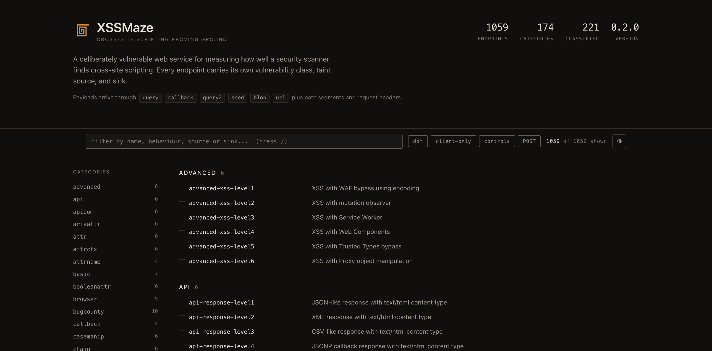

[](https://github.com/hahwul/xssmaze/actions/workflows/crystal_build.yml)
[](https://github.com/hahwul/xssmaze/actions/workflows/crystal_lint.yml)
[](https://github.com/hahwul/xssmaze/actions/workflows/ghcr.yml)

XSSMaze is an intentionally vulnerable web application for measuring and improving XSS detection in security testing tools. It covers a wide range of XSS contexts: basic reflection, DOM, header, path, POST, redirect, decode, hidden input, in-JS, in-attribute, in-frame, event handler, CSP bypass, SVG, CSS injection, template injection, WebSocket, JSON, advanced techniques, polyglot, browser-state, opener, storage-event, stream, channel, service-worker, history-state, reparse, and referrer.



## Installation

### From Source
```bash
shards install
shards build
./bin/xssmaze
```

### From Docker
```bash
docker pull ghcr.io/hahwul/xssmaze:main
docker run -p 3000:3000 ghcr.io/hahwul/xssmaze:main
```

## Usage
```
./bin/xssmaze

Options:
  -b HOST, --bind HOST             Host to bind (defaults to 127.0.0.1; pass 0.0.0.0 to expose on the network)
  -p PORT, --port PORT             Port to listen for connections (defaults to 3000)
  -s, --ssl                        Enables SSL
  --ssl-key-file FILE              SSL key file
  --ssl-cert-file FILE             SSL certificate file
  -h, --help                       Shows this help
```

## Endpoint Map
```bash
curl http://localhost:3000/map/text         # newline-separated URLs
curl http://localhost:3000/map/json         # full metadata (also: ?type=dom or ?q=csp)
curl http://localhost:3000/map/markdown     # markdown table
curl http://localhost:3000/map/categories   # categories with counts
curl http://localhost:3000/map/openapi      # OpenAPI 3.0 catalog
curl http://localhost:3000/sitemap.xml      # sitemap of all maze paths
curl http://localhost:3000/health           # liveness probe
curl http://localhost:3000/version          # version + counts
curl -L http://localhost:3000/random        # 302 to a random maze
```

The index page (`/`) provides a client-side filter, per-category counts, and links to all of the maps above. Map endpoints serve a payload that is built once at startup, cached, and gzip pre-compressed (`Accept-Encoding: gzip` cuts the index payload by ~85%), so they're safe to poll from tooling.

## Benchmarking Scanner Tools

XSSMaze includes an automated benchmark tool to measure how well XSS scanners perform against the lab's diverse vulnerability scenarios. The tool retrieves all endpoints from `/map/json`, runs scanner tools against them, and generates a detection scorecard.

### Requirements

- Python 3.x
- `requests` library (`pip install requests`)
- Scanner tools (e.g., [Nuclei](https://github.com/projectdiscovery/nuclei))

### Quick Start

```bash
# Start XSSMaze (in one terminal)
./bin/xssmaze -b 0.0.0.0

# Run benchmark (in another terminal)
cd scripts
./benchmark.sh http://localhost:3000
```

### Usage Examples

```bash
# Basic benchmark with console output
python3 benchmark.py http://localhost:3000

# Verbose mode (shows detailed progress)
python3 benchmark.py http://localhost:3000 -v

# Generate markdown report
python3 benchmark.py http://localhost:3000 -o report.md

# Run specific scanner only
python3 benchmark.py http://localhost:3000 --scanner nuclei

# Use a custom scanner command
python3 benchmark.py http://localhost:3000 \
  --custom-scanner "myxss {URL}" \
  --custom-scanner-name "MyXSSScanner"
```

### Output Format

The benchmark tool provides:

- **Console Scorecard**: Summary table showing detection rates for each scanner
- **Detailed Statistics**:
  - Total registered endpoints
  - Endpoints successfully detected (True Positives)
  - Endpoints missed (False Negatives)
  - Overall detection rate percentage
  - Breakdown of missed detections by category
- **Markdown Report** (optional): Exportable report with full benchmark results

Example output:
```
======================================================================
XSSMaze Scanner Benchmark Results
======================================================================

Target: http://localhost:3000
Total Registered Endpoints: 450
Categories: 45

Scanner              Detected     Missed       Rate         Time (s)
----------------------------------------------------------------------
Nuclei               234          216          52.0%        125.3s

--- Nuclei Detailed Results ---
✓ True Positives: 234/450
✗ False Negatives (Missed): 216/450

Missed by category:
  advanced: 6/6 missed
  csp-bypass: 5/5 missed
  template-injection: 6/6 missed
```

### Supported Scanners

The benchmark tool currently supports:

- **Nuclei**: Uses XSS-related templates from the Nuclei template library
- **Custom Scanners**: Any tool that can accept a URL and output results

### Adding New Scanners

To add support for a new scanner:

1. Use the `--custom-scanner` option with command template
2. Or extend `benchmark.py` with a new scanner method

Example for adding a scanner permanently:
```python
def run_my_scanner(self) -> ScannerResult:
    # Implementation here
    pass
```
